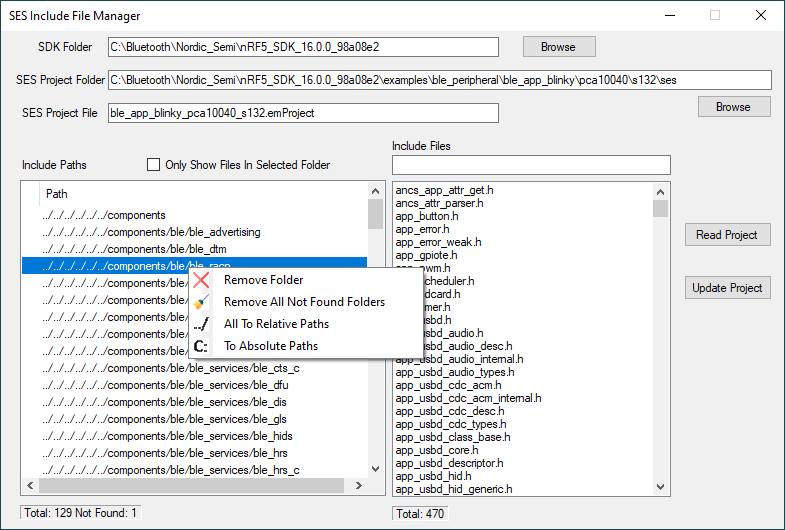
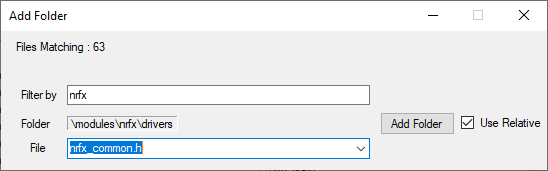

# SES Include File Manager

A simple helper application for use with Segger Embedded Studio when working with the Nordic Semiconductor SDK.  
The application checks which paths exist and allows you to remove those that don't, allows a search by filename to show which folder they are in, and allows conversion between relative and absolute paths for the include folders.

(It does not search your SDK folder for include files to automatically add them to the include paths.)

## Why this program was written

The Nordic SDK folder is structured so that many include files which are needed for a project are in different folders. All of the folder paths need to be added to the c_user_include_directories definition for the project to compile. 

It is time consuming to search for each include file that a compile will complain about being missing so that it's path can be added to the project c_user_include_directories. It is easy to end up with duplicate paths and unnecessary paths. The relative path can be tricky to manage due to its change of depth (number of ../) when a project is moved within the folder structure.

## Usage

- SDK Folder is the absolute path to the SDK being worked with. Browse button allows this to be selected and the program remembers the last selection.
- SES Project Folder is the absolute path to the project folder which contains the project file. Browse button allows this to be selected and the program remembers the last selection.
- SES Project file is the emProject file within the SES Project Folder.

### Read Project
Opens the file, parses it and shows the results in two lists - Include Paths and Include Files. All paths are checked for existance on the disk and if not found, an exclamation point is shown the left column. Counts are shown at the bottom of the lists.  

### Only Show Files In Selected Folder
If unchecked, the Include Files list shows all the files from all the Include Paths.  
Clicking on a file causes the corresponding folder to be highlighted.  
If checked, the Include Files list only shows the files in that folder.  

### Search Include Files
When Only Show Files in Selected Folder is unchecked the text box above the Include Files list acts as a search box which dynamically updates on each character changed. Wild cards and patterns are not supported since the matching is done simply on a String.Contains method so the searched text can appear anywhere in the name.

### Right Click in Paths List
- Remove Folder. Removes just the one folder selected.
- Remove all Not Found Folders. Cleans up the folders so that any which do not exist are removed.
- All To Relative Paths. Scans SDK folder for the folders listed and makes up a relative path for them which works for the project location. The config folder is treated as a special case because there are multiple config folders in the SDK, one for each example project and the one to be used is the one nearest to the project folder. The program scans the folder tree upwards from the project to find it.
- To Absolute Paths. Converts all selected folder relative paths to absolute paths. You can run this on many selected paths by using the multiselect feature of the Include Paths listview eg hold down Shift to select the last item, or Control-Click to select multiple items.

### Edit an Include Path
Double click on the Include Path item to bring up and edit box containing the existing value. Since the list is sorted, it may return to a different place in the list when altered. If the path does not exist an exclamation point will be shown against that path.

## Add Folder

Add Folder... button brings up an Add Folder dialog box. If you have already started searching for a file in the main dialog, that search text is used in the Add Folder dialog.

There is a short wait while the file system is searched for suitable include files and folders (all *.h files in the SDK folder excluding the examples folder). A progress bar is shown while searching and the current folder being loaded is shown.

Filter by some partial string and the list of files containing that string are shown in the dropdown box. As each one is selected, the containing folder is displayed. Add that folder to the Include Paths by clicking Add Folder. By default the path used is relative to the current project but that can be changed to absolute paths by changing the Use Relative checkbox.  

As the Filter By text is changed, the number of matching files is displayed. You may add multiple files and see the results in the main form without closing the Add Folder dialog. Folders that already exist are not added again and a message is shown.  

### Update Project
Writes back to the emProject file. Only the c_user_include_directories line will be changed. Line endings are auto detected when the file is read and are used when the file is written.

## Icon Attributions
Some icons made by me.  
Some Icons made by <a href="http://www.freepik.com/" title="Freepik">Freepik</a> from <a href="https://www.flaticon.com/" title="Flaticon">www.flaticon.com</a>

 
## Installation
The [executable](SESIncludeFileManager/bin/x86/Release/SESIncludeFileManager.exe) is a single file which runs on Windows 10 assuming the .NET Framework 4.7.2 is installed, so it does not need an installer.  
